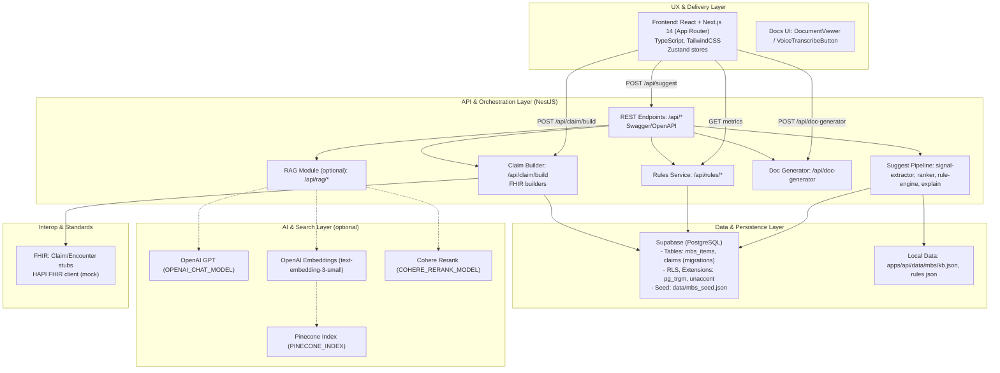

## MBSPro Architecture Overview

This diagram reflects the current repository structure and implemented modules across `apps/web` (Next.js) and `apps/api` (NestJS), plus shared types and data sources.

```mermaid
flowchart TB
  subgraph Web["Next.js Frontend (@mbspro/web)"]
    W1["/ (Notes Editor)<br/>apps/web/src/app/page.tsx"]
    W2["/suggestions (Inline Suggestions)<br/>apps/web/src/app/suggestions/page.tsx"]
    W3["/claim-builder (Claim Draft)<br/>apps/web/src/app/claim-builder/page.tsx"]
    W4["/dashboard (Compliance & Revenue)<br/>apps/web/src/app/dashboard/page.tsx"]
    WC1["Hooks: useSupabaseData, useDocumentGeneration<br/>apps/web/src/hooks/*"]
    WL1["Lib: quickRules (client-side hints)<br/>apps/web/src/lib/quickRules.ts"]
    WS1["Store: Zustand stores<br/>useSuggestResults / useClaimDraft / usePatientSelection"]
    Wv["VoiceTranscribeButton (optional STT)<br/>apps/web/src/components/VoiceTranscribeButton.tsx"]
  end

  subgraph API["NestJS Backend (@mbspro/api)"]
    direction TB
    A0["AppModule / main.ts"]

    subgraph Health["Health"]
      A1["GET /api/health\nhealth.module.ts"]
    end

    subgraph Suggest["Suggest Engine"]
      direction TB
      S1["POST /api/suggest\nsuggest.controller.ts"]
      S2["suggest.service.ts<br/>signal-extractor / ranker / rule-engine / explain"]
      S3["mbs_rules.json (normalized)"]
      SV["vapi.controller.ts / vapi.service.ts (optional LLM proxy)"]
    end

    subgraph MBS["MBS Catalogue"]
      direction TB
      M1["loader / mbs.service.ts<br/>loads data/mbs/kb.json, rules.json"]
      M2["retriever.service.ts / metrics.controller.ts"]
      M3["entities/mbs-item.entity.ts"]
      M4["mbs.controller.ts / admin.controller.ts"]
    end

    subgraph Rules["Rules API"]
      R1["POST /api/rules/*<br/>rules.controller.ts / rules.service.ts"]
    end

    subgraph RAG["RAG (optional)"]
      G1["/api/rag/*<br/>rag.controller.ts / rag.service.ts"]
    end

    subgraph Claim["Claim Builder"]
      C1["POST /api/claim/build\nclaim.controller.ts / claim.service.ts"]
      C2["FHIR builders<br/>claim.builder.ts / encounter.builder.ts / bundle.builder.ts"]
      C3["mbs-catalog.ts (FHIR mapping)"]
      C4["HAPI FHIR client (mock)<br/>hapi.client.ts"]
    end

    subgraph Docs["Docs Autopilot"]
      D1["POST /api/doc-generator\ndoc-generator.controller.ts / service.ts"]
      D2["DTOs: generate-doc-*.dto.ts"]
    end

    subgraph Services["Infra"]
      I1["Supabase service<br/>services/supabase.service.ts"]
      I2["Config<br/>config/*.ts (db, supabase)"]
      I3["Filters<br/>common/fhir-exception.filter.ts"]
    end
  end

  subgraph Data["Data & Scripts"]
    direction TB
    D01["apps/api/data/mbs/kb.json, rules.json"]
    D02["root/data/mbs_seed.json (seed)"]
    D03["scripts/normalize-mbs-rules.js, eval.js"]
    D04["eval/*.jsonl (gold, notes)"]
    D05["supabase/schema.sql + migrations/*"]
  end

  subgraph Shared["Shared Package (@mbspro/shared)"]
    P1["Types: SuggestRequest/Response, Signals, RuleResult<br/>packages/shared/src/index.ts"]
  end

  subgraph External["External (optional)"]
    E1["Supabase (DB)"]
    E2["LLM Provider"]
    E3["Pinecone / OpenAI (RAG)"]
    E4["HAPI FHIR Server (mock)"]
  end

  %% Frontend -> API
  W1 -->|"POST /api/suggest"| S1
  W2 -->|"POST /api/suggest"| S1
  W3 -->|"POST /api/claim/build"| C1
  W3 -->|"POST /api/doc-generator"| D1
  W4 -->|"GET metrics & history"| M2

  %% Suggest uses
  S2 --> M1
  S2 --> R1
  S2 --> P1
  S2 --> D01
  SV -.-> E2

  %% Claim uses
  C1 --> C2
  C2 --> C3
  C1 --> C4
  C1 --> P1
  C4 <--> E4

  %% Rules uses
  R1 --> P1

  %% Infra
  A1 --> I1
  M1 --> I1
  C1 --> I1
  I1 <--> E1

  %% Data lineage
  D02 -->|"seed"| I1
  D01 --> M1
  D03 --> D01
  D04 --> S2
  D05 --> I1

  %% Optional RAG links
  S2 -.-> G1
  G1 -.-> E3
```

Notes:
- Frontend integrates with backend suggest, claim builder and doc generator endpoints.
- Backend uses Supabase as the primary data store and optional external services for RAG/LLM/FHIR.
- Shared types ensure consistent contracts between front and back ends.

---

## Layered Technology Stack

### Concrete Technology Choices
- **Frontend**: React 18 + Next.js 14 (App Router), TypeScript, TailwindCSS, Zustand。
- **API**: NestJS + TypeScript，REST 风格，Swagger/OpenAPI 文档。
- **Suggest/Rerank**: 本地 ranker（lexical + features）为主，可选 RAG（OpenAI embeddings + Pinecone）与 Cohere rerank；受 `SUGGEST_MODE=local|rag|hybrid` 控制。
- **Rule Engine**: 基于 JSON 规则（`apps/api/data/mbs/rules.json`）+ 程序化校验（互斥、时长、远程/现场、护理计划窗口等），产出 `RuleResult`。
- **FHIR/HAPI**: `claim.builder.ts / encounter.builder.ts / bundle.builder.ts` 生成 FHIR 资源；`hapi.client.ts` 作为 HAPI FHIR 交互（Mock/可替换）。
- **Database**: Supabase (PostgreSQL)；开启 pg_trgm/unaccent；通过 migrations 建表；`services/supabase.service.ts` 统一访问。
- **Infra/Config**: `.env` 通过 `apps/api/env.example` 定义 OpenAI/Pinecone/Cohere/Supabase 等。

### 可选与扩展
- **STT**: `VoiceTranscribeButton` 预留语音入口，可对接 Whisper/Web Speech API。
- **Caching**: 规则与目录内存缓存，后续可用 Redis。
- **Observability**: 健康检查与自定义 metrics 控制器，后续可接 Prometheus/Grafana。

