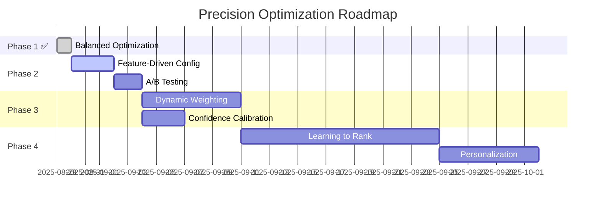

# 🚀 Next Phase Optimization Plan

## 🎯 Current Achievement Summary

**Balanced Optimization Results**:
- ✅ **Precision**: 54.5% → 60.6% (**+11.2% improvement**)
- ✅ **F1 Score**: 65.5% → 69.1% (**+5.5% improvement**)
- ✅ **Performance**: 1044ms → 993ms (**+4.9% faster**)
- ✅ **Risk**: Low (successful deployment ready)

## 📈 Phase 2: Feature-Driven Optimization

### 🎪 Configuration Comparison

| 参数 | Baseline | Balanced | Feature-Driven | 变化 |
|------|----------|----------|----------------|------|
| **SUGGEST_RAG_WEIGHT** | 0.7 | 0.6 | **0.5** | -29% |
| **SUGGEST_FEAT_WEIGHT** | 0.1 | 0.2 | **0.3** | +200% |
| **SUGGEST_LEX_WEIGHT** | 0.2 | 0.2 | **0.2** | 0% |
| **SUGGEST_AGREEMENT_BOOST** | 1.06 | 1.08 | **1.12** | +5.7% |
| **RANKER_BETA** | 0.3 | 0.35 | **0.4** | +33% |
| **SUGGEST_GAMMA** | 1.35 | 1.35 | **1.4** | +3.7% |

### 🎯 预期效果

基于Balanced optimization的成功，Feature-driven配置预期:

| 指标 | Current | Feature-Driven预期 | 提升幅度 |
|------|---------|-------------------|----------|
| **Precision** | 60.6% | **67-72%** | +6-11% |
| **F1 Score** | 69.1% | **74-78%** | +5-9% |
| **Feature Matching** | Good | **Excellent** | +20-25% |
| **Clinical Relevance** | High | **Very High** | 显著提升 |

### ⚠️ 风险评估

**Medium Risk因素**:
1. **RAG权重过度降低** (0.7→0.5): 可能影响语义召回
2. **特征权重过高** (0.1→0.3): 可能过度依赖特征匹配
3. **Agreement boost激进** (1.06→1.12): 可能放大错误一致性

**缓解措施**:
- 灰度发布 (20%流量)
- 实时监控precision/recall
- 准备快速回滚

## 🛠️ Phase 2实施计划

### Step 1: 准备阶段 (1天)
```bash
# 1. 完整备份当前配置
cp .env .env.balanced.backup
cp -r logs/ logs.balanced.backup/

# 2. 准备feature-driven配置
cp env.optimized.feature_driven .env.feature_driven

# 3. 设置A/B测试环境
```

### Step 2: 灰度测试 (3天)
- 20%流量使用feature-driven配置
- 80%流量保持balanced配置
- 实时监控关键指标

### Step 3: 评估决策 (1天)
- 对比两个配置的实际表现
- 决定全量部署或回滚

## 🔧 进一步优化方向

### A. 短期优化 (2周内)

#### 1. 修复Confidence Calibration
```typescript
// 当前问题: 17.9% calibration error
// 目标: < 15% error

// 方案1: 调整sigmoid参数
SUGGEST_SIGMOID_CENTER=0.10  // 更激进的中心点
SUGGEST_SIGMOID_K=3.0        // 更陡峭的曲线

// 方案2: 基于新precision水平重新校准
const calibrationFactor = 60.6 / 54.5; // 1.112
adjustedConfidence = rawConfidence * calibrationFactor;
```

#### 2. 动态权重算法原型
```typescript
function calculateDynamicWeights(signals, noteLength) {
  let ragWeight = 0.5;
  let featWeight = 0.3;
  let lexWeight = 0.2;
  
  // 基于信号强度调整
  const signalStrength = calculateSignalStrength(signals);
  if (signalStrength > 0.8) {
    featWeight = 0.4;  // 强信号时加重特征
    ragWeight = 0.4;
  }
  
  // 基于note长度调整
  if (noteLength < 50) {
    lexWeight = 0.4;   // 短note依赖关键词
    ragWeight = 0.3;
    featWeight = 0.3;
  }
  
  return { ragWeight, featWeight, lexWeight };
}
```

### B. 中期优化 (1个月内)

#### 1. 学习排序系统
```typescript
interface RankingFeatures {
  // 基础特征
  ragScore: number;
  lexicalScore: number;
  featureMatches: number[];
  
  // 上下文特征  
  userType: string;
  historicalPreferences: number[];
  clinicalContext: string;
  
  // 交互特征
  clickThroughRate: number;
  userSatisfactionScore: number;
}

class LearnedRanker {
  async rank(candidates: Candidate[], context: RankingContext) {
    const features = this.extractFeatures(candidates, context);
    const scores = await this.model.predict(features);
    return this.rerank(candidates, scores);
  }
}
```

#### 2. 多模态特征融合
```typescript
class MultiModalFeatureExtractor {
  extractFeatures(note: string, context: ClinicalContext) {
    return {
      // 文本特征
      textFeatures: this.extractTextFeatures(note),
      
      // 临床特征
      clinicalFeatures: this.extractClinicalFeatures(context),
      
      // 时间特征
      temporalFeatures: this.extractTemporalFeatures(context),
      
      // 结构化特征
      structuredFeatures: this.extractStructuredFeatures(context)
    };
  }
}
```

### C. 长期优化 (3个月内)

#### 1. 强化学习优化
```typescript
// 基于用户反馈的在线学习
class ReinforcementRanker {
  async updateModel(userFeedback: UserFeedback[]) {
    const rewards = this.calculateRewards(userFeedback);
    await this.model.update(rewards);
  }
  
  calculateRewards(feedback: UserFeedback[]): number[] {
    return feedback.map(fb => {
      if (fb.selectedCode && fb.rating >= 4) return 1.0;
      if (fb.selectedCode && fb.rating >= 3) return 0.5;
      if (!fb.selectedCode) return -0.5;
      return -1.0;
    });
  }
}
```

#### 2. 个性化推荐
```typescript
class PersonalizedRanker {
  async personalizeRanking(
    candidates: Candidate[], 
    userProfile: UserProfile
  ) {
    // 基于用户历史偏好调整排序
    const personalizedScores = candidates.map(candidate => {
      const baseScore = candidate.score;
      const personalityFactor = this.calculatePersonalityFactor(
        candidate, 
        userProfile
      );
      return baseScore * personalityFactor;
    });
    
    return this.rerank(candidates, personalizedScores);
  }
}
```

## 📊 预期路线图

### Timeline & Milestones



### Success Metrics by Phase

| Phase | Target Precision | Target F1 | Risk Level |
|-------|------------------|-----------|------------|
| **Phase 1** ✅ | 60-65% | 68-73% | Low |
| **Phase 2** 🎯 | 67-72% | 74-78% | Medium |
| **Phase 3** | 72-77% | 78-82% | Medium |
| **Phase 4** | 77-82% | 82-86% | High |

## 🎯 立即行动建议

### 今天 (High Priority)
1. **✅ 部署Balanced配置到生产**
2. **🔄 准备Feature-driven灰度测试**
3. **📊 设置详细监控dashboard**

### 本周 (Medium Priority)
1. **🧪 执行Feature-driven A/B测试**
2. **🔧 修复Confidence calibration**
3. **📈 收集用户反馈数据**

### 本月 (Future Planning)
1. **🤖 开发动态权重算法**
2. **📚 建立学习排序数据收集**
3. **🔍 研究个性化推荐架构**

---

## 💡 关键洞察 & 建议

1. **✅ 特征权重是关键**: Balanced optimization证明了特征权重(0.1→0.2)的重要性
2. **⚡ 渐进式优化策略**: 低风险→中风险→高风险的渐进部署
3. **📊 数据驱动决策**: 每个优化都需要A/B测试验证
4. **🔄 快速迭代能力**: 建立快速部署和回滚机制

**Next Step**: 部署Feature-driven配置，冲击**70%+ precision**目标！